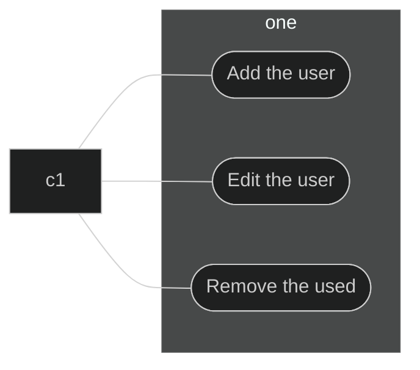

# I finally made a portfolio!

I finally did it! This is the second time using React. The first time was an attempt to make a discord bot client that did not really go anywhere, the only thing created in that project was the login screen.

# Le good

First time using react and nextjs, the App Router style was actually quite pleasant. Tailwind CSS is actually the goat tho, it was genuinely so nice to use and provided a lot of freedom on how to style certain elements. The way Tailwind CSS is structured allows to just add classes to style which is very cool. The docs telling you exactly what the CSS each class contains was nice, and the nice docs page was a great thumbs up.

Another great thing is grids and flexboxes, thank god to whoever introduced them into CSS. This in addition to Tailwind CSS made it fairly easy (for the most part) to layout the different elements, it was surprisingly easy to centre a div (something that I very much dreaded). I did however have trouble styling things to the left if I was using `place-item-center`.

This with some _stealing_ from the default starter repo like those buttons in [projects](/projects) allowed to easily make the homepage and the projects page. I'm also fairly happy with how both pages turned out and happy with the way the navbar turned out.

# Le bad

I started to have troubles when I tried to setup [Markdoc](https://markdoc.dev/) with the App Router directory. This is seemingly not supported by default unfortunately.

This was quite frustrating since a lot of Markdoc's nice features, such as the content for creating a table of contents was nicely passed down a `pageProps` variable in `_app.tsx`. This was removed in App Router :(

Markdoc also introduced a bunch of type errors which were annoying to fix, sometimes to the point where I would just slap an `any` type and call it done.

# My saviour

I stumbled across this [project](https://github.com/dylanmeivis/nextjs13-starter-markdoc) when googling how to integrate Markdoc with the App Router project. God bless them, this contained code that would very much be the base of the blog section. Hopefully, eventually, there will come a time when proper Markdoc integration with App router will be created, allowing to more easily access the values within page props, who knows [when](https://github.com/markdoc/markdoc/discussions/462).

However, this allowed me to more easily create a Sidebar listing all the blog posts. This is because the `generateStaticParmas` was already created, so we could use that to generate the Sidebar, so that was nice. This was a side effect of being forced to use nextjs dynamic routes, such as `[slug]`, so it worked out in the end, being able to create a Sidebar without hardcoding the paths.

# Final thoughts and future considerations

I'm actually genuinely happy with how this site turned out. It was a really good idea to make a mockup _(VCE Software Development reference)_ in [Figma](https://www.figma.com/) first before committing to it. Being able to customise pretty much anything with Markdoc is pretty neat (albeit I have to actually create the components), like codeblocks with syntax highlighting (omg?!).

```rust
pub fn this_is_so_cool_highlighting() {
    println!("This is some epic syntax highlighting with highlightjs")
}
```

Latex with MathJax?!

$$\sigma = \sqrt {\int_{-\infty}^{\infty}{(x - \mu\)^2f(x)dx}}$$

Fun callouts!


This is a test



This is a test



This is a test



This is a test


Mermaid diagrams?




I'll probably feature more cool stuff when I add support for them.

This is pretty cool though, being able to use Markdown, especially since I have already setup Neovim to be able to edit Markdown files.

Something I might do is explore using [MDXJS](https://mdxjs.com/) instead of Markdoc, just to see how that turns out.

That being said there is still a lot that needs to be done with this site:

- Sort the left sidebar by ids/creation date
- ~~Make the left sidebar not move when scrolling~~
- Make the navbar sticky
- ~~Create a table of contents to the right~~
- Add more style elements (eg: blockquotes, tables)
- Add more stuff to the social media area in the homepage
- ~~Fix some weird looking elements on mobile~~

Hot reloading doesn't work :( because it probably does not detect changes in the articles directory. Well, what can you really do.
